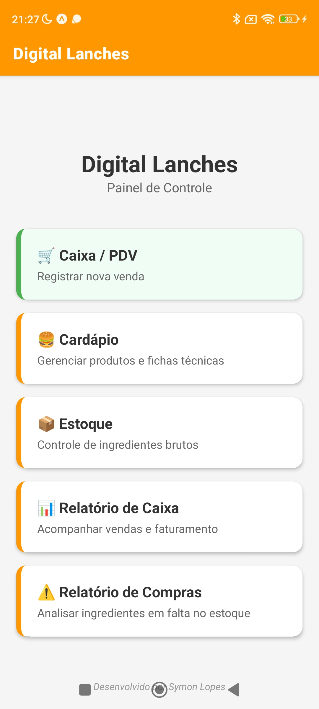
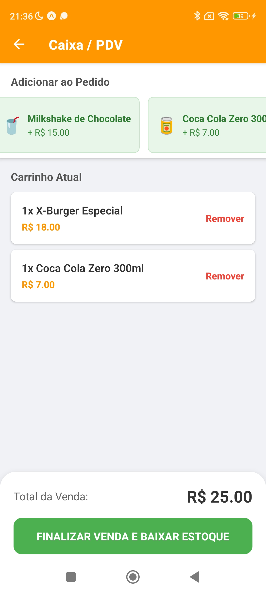
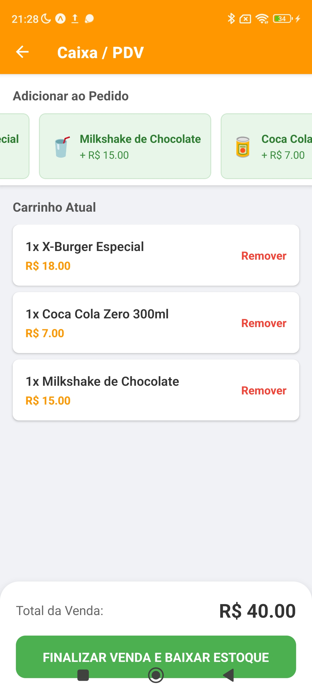
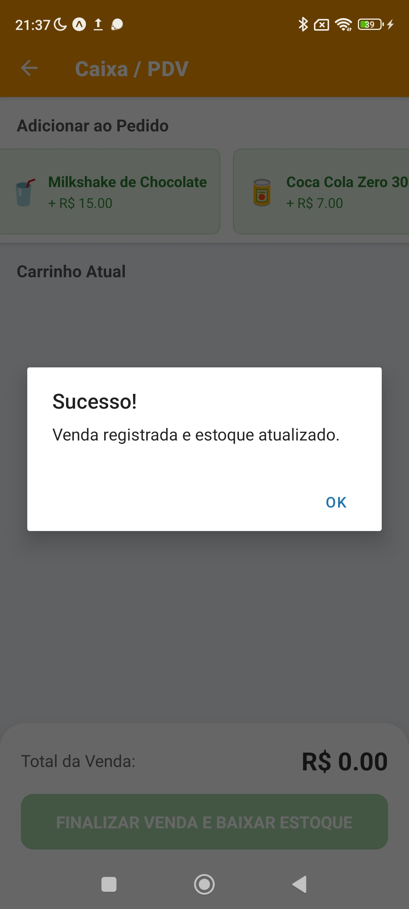
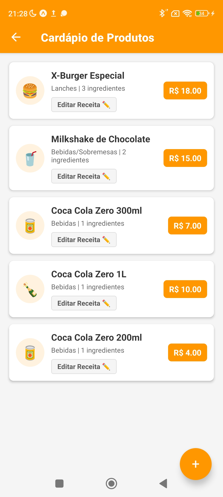
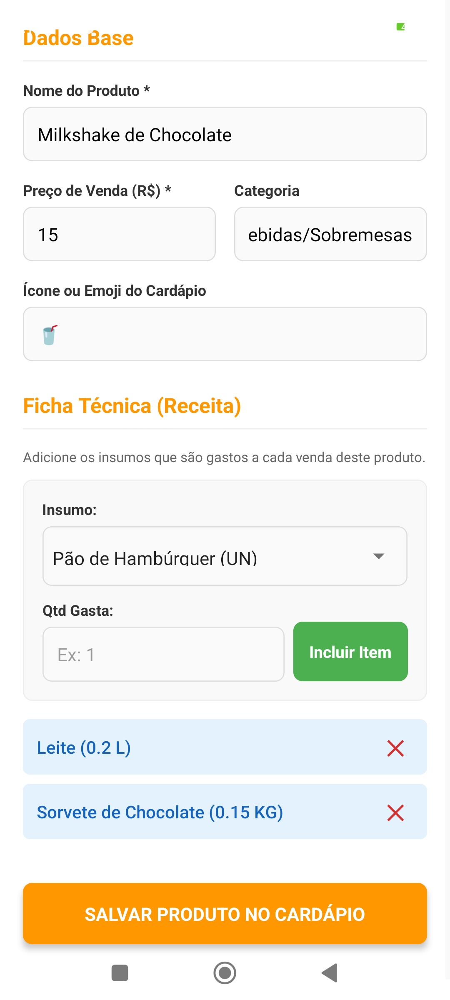
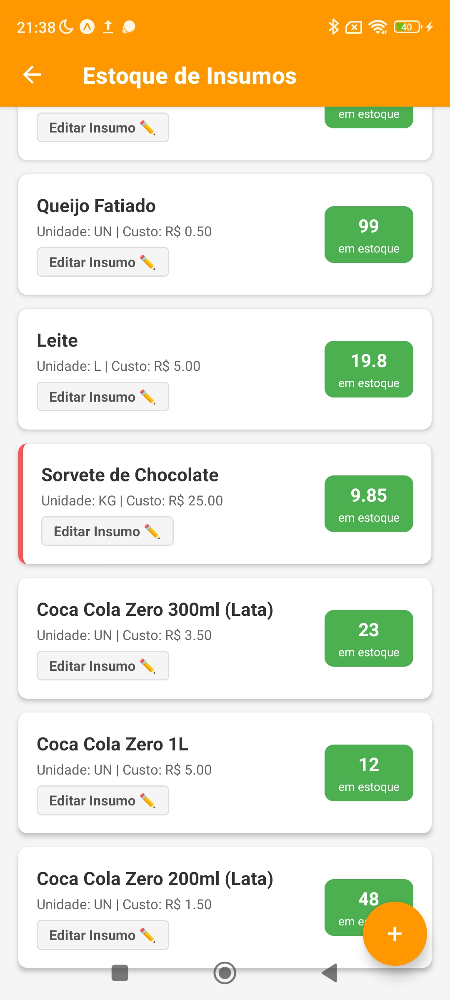
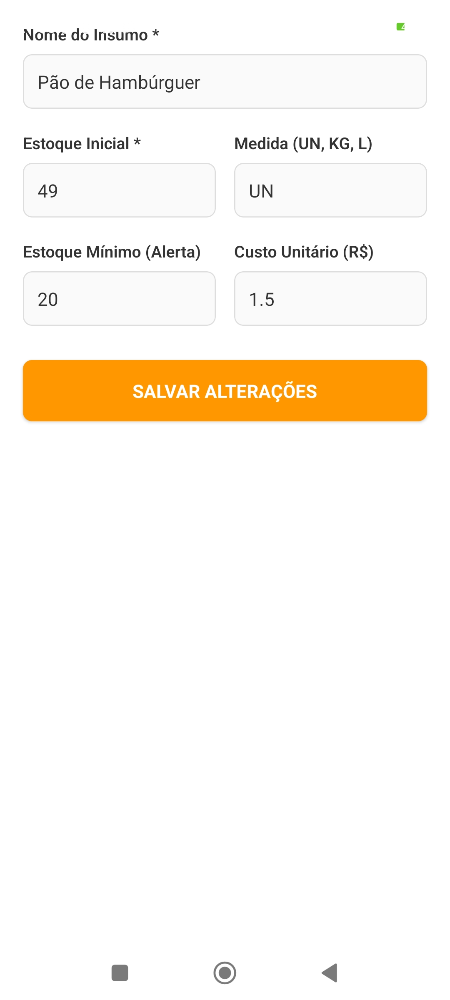
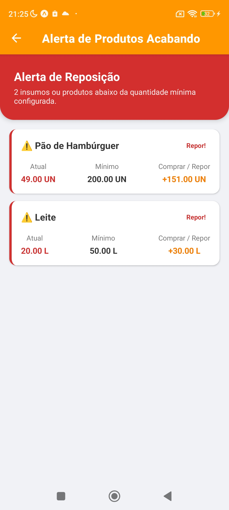

# 🍔 Digital Lanches - Gestão de Delivery (PDV e Estoque)

Este projeto é um aplicativo móvel voltado para a **gestão de compras e vendas** de uma lanchonete parceira (Digital Lanches). Ele resolve o problema da gestão manual de estoque, ajudando pequenos negócios a digitalizarem de ponta a ponta suas operações diárias.

O aplicativo centraliza as funções de Frente de Caixa (PDV), controle da Ficha Técnica dos produtos e a gestão inteligente de insumos brutos com alertas de reposição. Tudo isso com foco em usabilidade e agilidade, garantindo eficiência e mitigando os erros (e desperdícios) do pequeno empreendedor!

---

## 📱 Fluxo de Telas e Funcionalidades

### 1. Painel de Controle (Home)
O ponto de partida do aplicativo. Um dashboard limpo para navegar facilmente entre as operações vitais da lanchonete: Caixa/PDV, Gestão do Cardápio, Controle do Estoque Bruto e a Inteligência de Relatórios.

---

### 2. Frente de Caixa (PDV)
A tela onde a mágica acontece. O atendente seleciona rapidamente os itens do cardápio e adota um fluxo de fast-checkout. Ao finalizar a venda, o **sistema deduz o estoque automaticamente** pegando como base a ficha técnica estrita (receita) de cada hambúrguer ou bebida vendidos.

  
  
  

---

### 3. Gestão Inteligente: Fichas Técnicas e Insumos
O diferencial do negócio! Em vez de "chutar" pacotes de pão ao vender o lanche, os usuários cadastram a Ficha Técnica. Cada Hambúrguer debitado remove precisamente as fatias de queijo, as gramas de carne e a unidade de pão vinculada àquela receita.

#### Cardápio (Produtos Finais)

  
  

#### Estoque Bruto (Fatias, Kg, Unidades, Litros)
Todas as métricas gerenciáveis podem ser adicionadas e ajustadas em lote no formulário de estoque.

  
  

---

### 4. Inteligência e Relatórios Financeiros
O aplicativo atua ativamente para garantir que a lanchonete **nunca fique sem ingredientes básicos**, processando painéis pró-ativos sobre estoques que atingiram a quantidade mínima definida para a reposição.

  
  

---

## 🛠️ Stack e Tecnologias

- **React Native** (Framework App Mobile).
- **Expo Framework** (Prototipação rápida e compatibilidade).
- **TypeScript** (Verificação de tipagem rígida, blindando a integridade das receitas e persistência).
- **Zustand** (Gestão de estado reativo, performático e _store_ robusta em memória). React Navigation.

---
> Projeto de cunho acadêmico e de extensão sociocomunitária (Programação para Dispositivos Móveis - 2025). Desenvolvido por Paul Symon Braz Moura Lopes.
